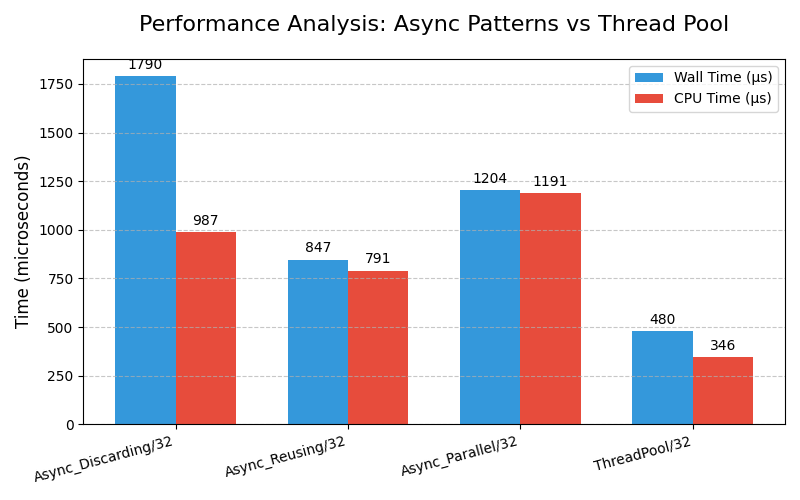
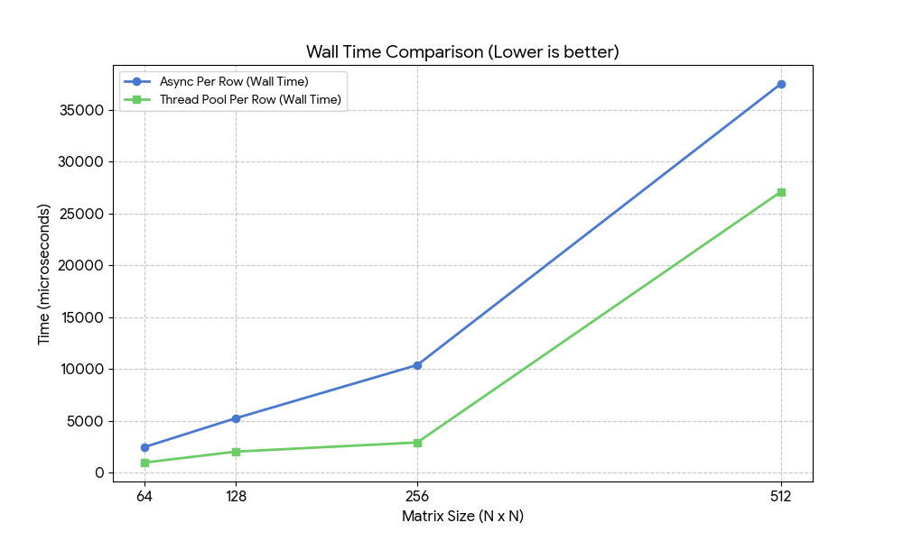
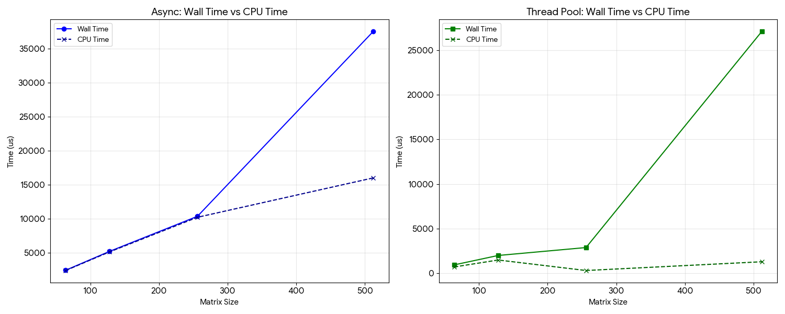
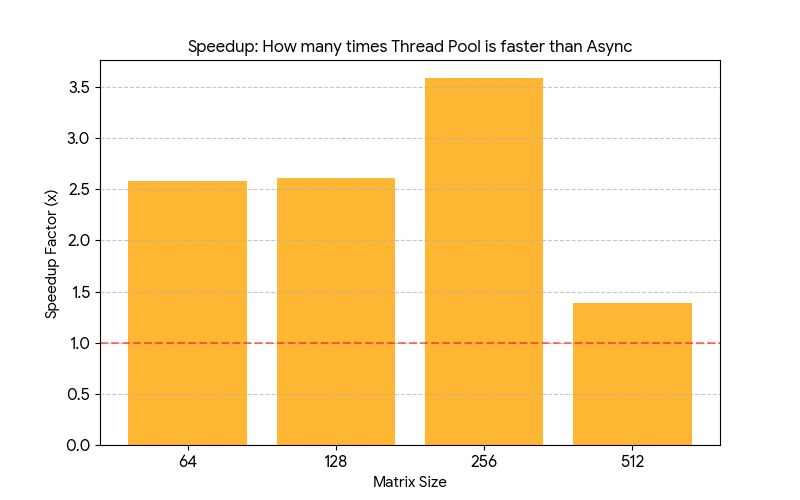

### Concurrent and asynchronous programming with C++:


3. [How to Create and Manage Threads in C++](https://github.com/emelyantsev/Asynchronous-Programming-with-CPP/tree/main/chapters/chapter_03)
4. [Thread Synchronization with Locks](https://github.com/emelyantsev/Asynchronous-Programming-with-CPP/tree/main/chapters/chapter_04)
5. [Atomic operations](https://github.com/emelyantsev/Asynchronous-Programming-with-CPP/tree/main/chapters/chapter_05)
6. [Promises and futures](https://github.com/emelyantsev/Asynchronous-Programming-with-CPP/tree/main/chapters/chapter_06)
7. [The async function](https://github.com/emelyantsev/Asynchronous-Programming-with-CPP/tree/main/chapters/chapter_07)


```bash
# run shell inside container
docker exec -it async_cpp bash

# build with cmake 
cmake -S . -B build_debug -D CMAKE_BUILD_TYPE=Debug
cmake --build build_debug
ctest --test-dir build_debug

# build benchmark
cmake -S . -B build  -DCMAKE_BUILD_TYPE=Release
cmake --build build

# run benchmark
./build/run_bench
./build/run_bench --benchmark_out=results.csv --benchmark_out_format=csv
./build/run_bench --benchmark_format=json > results.json
```


#### Benchmarks results

2. [Async future](benchmarks/02_async_future/source.cpp)



<details>
<summary>"Async future" console output</summary>

```console
Run on (8 X 3696.01 MHz CPU s)
CPU Caches:
  L1 Data 32 KiB (x4)
  L1 Instruction 32 KiB (x4)
  L2 Unified 256 KiB (x4)
  L3 Unified 20480 KiB (x1)
Load Average: 0.24, 0.22, 0.11
-----------------------------------------------------------------
Benchmark                       Time             CPU   Iterations
-----------------------------------------------------------------
BM_Async_Discarding/32    1790018 ns       987054 ns          674
BM_Async_Reusing/32        847071 ns       790595 ns          881
BM_Async_Parallel/32      1204084 ns      1190893 ns          580
BM_ThreadPool/32           480371 ns       346177 ns         2013
```
</details>


3. [Matrix multiplication](benchmarks/03_matrix_multiplication/source.cpp)





<details>
<summary>"Matrix multiplication" console output</summary>

```console
Run on (8 X 3696.01 MHz CPU s)
CPU Caches:
  L1 Data 32 KiB (x4)
  L1 Instruction 32 KiB (x4)
  L2 Unified 256 KiB (x4)
  L3 Unified 20480 KiB (x1)
Load Average: 0.48, 0.50, 0.55
----------------------------------------------------------------------------------
Benchmark                        Time             CPU   Iterations UserCounters...
----------------------------------------------------------------------------------
BM_AsyncPerRow/64             2455 us         2418 us          285 ThreadsCreated=64
BM_AsyncPerRow/128            5228 us         5154 us          136 ThreadsCreated=128
BM_AsyncPerRow/256           10372 us        10231 us           68 ThreadsCreated=256
BM_AsyncPerRow/512           37509 us        16013 us           42 ThreadsCreated=512
BM_ThreadPoolPerRow/64         953 us          719 us          981 ThreadsCreated=8
BM_ThreadPoolPerRow/128       2006 us         1499 us          462 ThreadsCreated=8
BM_ThreadPoolPerRow/256       2894 us          323 us         1000 ThreadsCreated=8
BM_ThreadPoolPerRow/512      27090 us         1303 us          100 ThreadsCreated=8
```
</details>